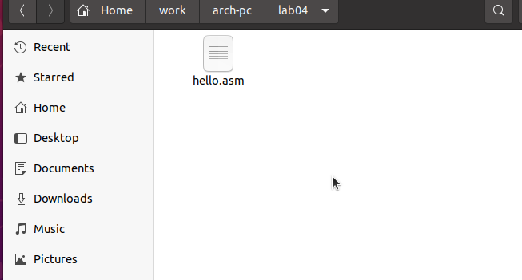
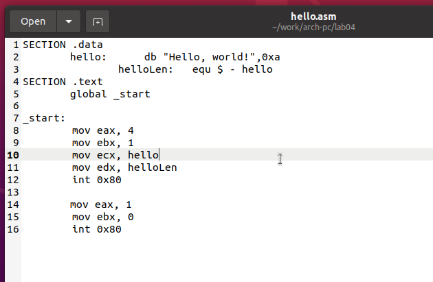
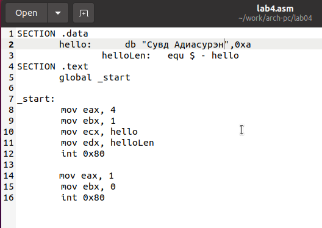

---
## Front matter
title: "Отчёт по лабораторной работе 4"
subtitle: "Архитектура компьютера"
author: "Сувд Адиасурэн"

## Generic otions
lang: ru-RU
toc-title: "Содержание"

## Bibliography
bibliography: bib/cite.bib
csl: pandoc/csl/gost-r-7-0-5-2008-numeric.csl

## Pdf output format
toc: true # Table of contents
toc-depth: 2
lof: true # List of figures
lot: true # List of tables
fontsize: 12pt
linestretch: 1.5
papersize: a4
documentclass: scrreprt
## I18n polyglossia
polyglossia-lang:
  name: russian
  options:
	- spelling=modern
	- babelshorthands=true
polyglossia-otherlangs:
  name: english
## I18n babel
babel-lang: russian
babel-otherlangs: english
## Fonts
mainfont: PT Serif
romanfont: PT Serif
sansfont: PT Sans
monofont: PT Mono
mainfontoptions: Ligatures=TeX
romanfontoptions: Ligatures=TeX
sansfontoptions: Ligatures=TeX,Scale=MatchLowercase
monofontoptions: Scale=MatchLowercase,Scale=0.9
## Biblatex
biblatex: true
biblio-style: "gost-numeric"
biblatexoptions:
  - parentracker=true
  - backend=biber
  - hyperref=auto
  - language=auto
  - autolang=other*
  - citestyle=gost-numeric
## Pandoc-crossref LaTeX customization
figureTitle: "Рис."
tableTitle: "Таблица"
listingTitle: "Листинг"
lofTitle: "Список иллюстраций"
lotTitle: "Список таблиц"
lolTitle: "Листинги"
## Misc options
indent: true
header-includes:
  - \usepackage{indentfirst}
  - \usepackage{float} # keep figures where there are in the text
  - \floatplacement{figure}{H} # keep figures where there are in the text
---

# Цель работы

Целью работы является освоение процедуры компиляции и сборки программ, написанных на ассемблере NASM.

# Выполнение лабораторной работы

## Программа Hello world!

Я создала каталог lab04 с помощью команды `mkdir`, затем перешла в него, используя команду `cd`, и создала файл `hello.asm`, в который будет написана программа. Чтобы убедиться, что файл был успешно создан, я выполнила команду `ls`.

{ #fig:001 width=70%, height=70% }

После этого я написала программу на языке ассемблера по заданию.

{ #fig:002 width=70%, height=70% }

## Транслятор NASM

Транслятор **NASM** превращает текст программы в объектный код. Если в тексте программы нет ошибок, транслятор преобразует её из файла `hello.asm` в объектный файл `hello.o`.

Я скомпилировала файл командой `nasm` и получила объектный файл `hello.o`.

Затем я повторно скомпилировала файл `hello.asm`, но уже с дополнительными опциями: 

- с опцией `-l` был получен файл листинга `list.lst`;
- с опцией `-f` получен объектный файл `obj.o`;
- с опцией `-g` в программу добавлена отладочная информация.

{ #fig:003 width=70%, height=70% }

## Компоновщик LD

Чтобы получить исполняемую программу, необходимо передать объектный файл на обработку компоновщику **LD**.

Я выполнила команду `ld` и скомпоновала объектный файл `hello.o`, получив исполняемый файл `hello`.

После этого я повторила команду `ld`, но уже для файла `obj.o`, что позволило мне получить исполняемый файл `main`.

{ #fig:004 width=70%, height=70% }

## Запуск исполняемого файла

Запустила оба исполняемых файла, чтобы проверить их работу.

{ #fig:005 width=70%, height=70% }

## Задание для самостоятельной работы

Для выполнения самостоятельного задания я скопировала файл `hello.asm` в новый файл `lan4.asm` командой `cp`.

В файле `lab4.asm` я изменила текст сообщения с "Hello world" на своё имя.

{ #fig:006 width=70%, height=70% }

Затем запустила изменённую программу и проверила результат.

{ #fig:007 width=70%, height=70% }

# Выводы

Таким образом, я успешно выполнила лабораторную работу, используя **NASM** и **LD** для трансляции, компоновки и запуска программ на языке ассемблера.
